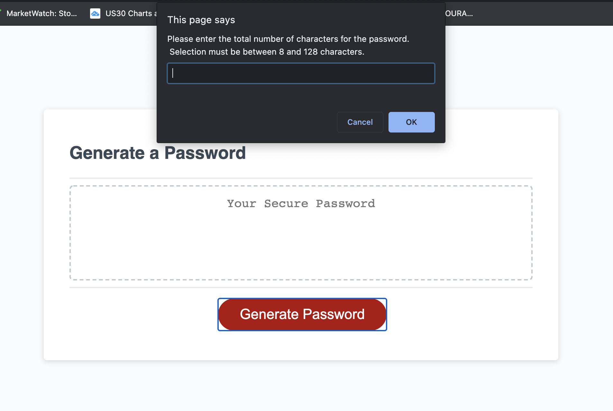

# Full-Stack Bootcamp - Week 3 Homework

## Passcode Generator
The application was designed to return a randomly created password that is flexible and re-adapts itself according to the user's prefered criterias.  
The selection criterias are:   
1 - Size of the password.
<i>User must select between 8 and 126 characters.</i>  
2 - To include lower case alpha characters.  
<i>User must between Ok(YES) or Cancel(NO</i>  
3 - To include upper case alpha characters.  
<i>User must between Ok(YES) or Cancel(NO</i>  
4 - To include numeric characters.  
<i>User must between Ok(YES) or Cancel(NO</i>  
4 - To include special characters.  
<i>User must between Ok(YES) or Cancel(NO</i>  
  
User must select at least one criteria, if so, a random password is generated for the selected length.

## Deployed application
https://bellasantiago.github.io/hw-passcode-generator/

## Github Repository
https://github.com/bellasantiago/hw-passcode-generator

## Finished Screenshots

